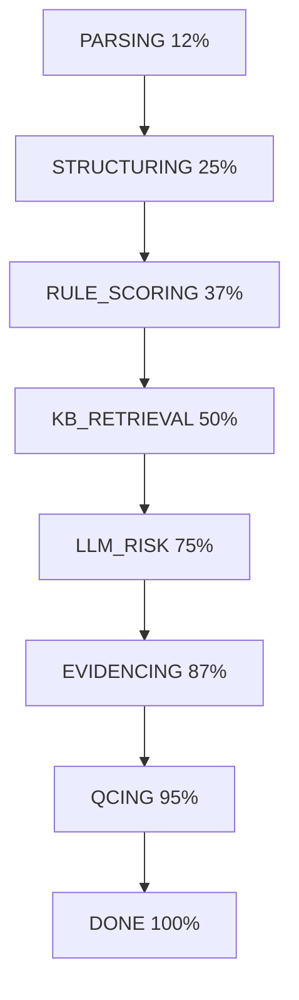

# 开发指南 | Development Guide

本文档为 Contract OS Simple 项目的开发者提供完整的开发环境配置、架构说明和最佳实践。

This document provides complete development environment setup, architecture overview, and best practices for developers working on Contract OS Simple.

## 目录 | Table of Contents

- [开发环境配置](#开发环境配置)
- [项目架构](#项目架构)
- [开发工作流](#开发工作流)
- [核心概念](#核心概念)
- [测试指南](#测试指南)
- [调试技巧](#调试技巧)
- [性能优化](#性能优化)

## 开发环境配置

### 前置要求

- **Python**: 3.11+ （推荐使用 pyenv 或 conda 管理）
- **Node.js**: 18+ （仅用于前端开发）
- **Git**: 用于版本控制
- **智谱AI API Key**: [申请地址](https://open.bigmodel.cn/)

### 环境搭建

#### 1. 克隆项目

```bash
git clone <repository-url>
cd contract_os_simple
```

#### 2. 创建虚拟环境

```bash
# 使用 venv
python -m venv .venv
source .venv/bin/activate  # Linux/macOS
.venv\Scripts\activate     # Windows

# 或使用 conda
conda create -n contract_os python=3.11
conda activate contract_os
```

#### 3. 安装依赖

```bash
# 后端依赖
pip install -r server/requirements.txt

# 前端依赖（可选）
cd client
npm install
cd ..
```

#### 4. 配置环境变量

```bash
cp .env.example .env
# 编辑 .env 文件，填入必要的配置
```

必需配置项：

```bash
# 智谱AI配置（必需）
ZHIPU_API_KEY=your-api-key-here

# 数据库路径（可选，默认 ./data/database.db）
DATABASE_PATH=./data/database.db

# 存储根目录（可选，默认 ./storage）
STORAGE_ROOT=./storage

# 服务器配置（可选）
HOST=0.0.0.0
PORT=8000

# 并发控制（可选）
MAX_CONCURRENT_TASKS=3
MAX_API_CONCURRENT=5
```

#### 5. 初始化数据库

```bash
python scripts/init_db.py
```

#### 6. （可选）导入示例数据

```bash
python scripts/seed_kb.py
```

### 开发工具推荐

#### Python 开发

- **IDE**: VS Code / PyCharm
- **VS Code 扩展**:
  - Python (Microsoft)
  - Pylance
  - pytest IntelliSense
  - SQLite Viewer

#### 代码质量工具

```bash
# 安装开发依赖
pip install black isort flake8 mypy pytest-cov

# 代码格式化
black server/
isort server/

# 代码检查
flake8 server/
mypy server/
```

### IDE 配置

#### VS Code 设置 (`.vscode/settings.json`)

```json
{
  "python.defaultInterpreterPath": "./.venv/bin/python",
  "python.linting.enabled": true,
  "python.linting.flake8Enabled": true,
  "python.formatting.provider": "black",
  "python.testing.pytestEnabled": true,
  "python.testing.pytestArgs": ["server/tests/"],
  "files.exclude": {
    "**/__pycache__": true,
    "**/*.pyc": true
  }
}
```

## 项目架构

### 技术栈

| 组件     | 技术                | 说明                     |
| -------- | ------------------- | ------------------------ |
| 后端框架 | FastAPI             | 高性能异步 Web 框架      |
| 数据库   | SQLite + SQLAlchemy | 轻量级关系型数据库 + ORM |
| 向量检索 | Faiss               | Facebook AI 相似性搜索库 |
| 任务队列 | asyncio             | Python 原生异步任务      |
| 文件存储 | 本地文件系统        | 简化部署                 |
| LLM      | 智谱AI API          | GLM-4-Flash 模型         |
| 前端     | React + Vite        | 保持与原版兼容           |

### 目录结构

```
contract_os_simple/
├── server/                      # 后端代码
│   ├── main.py                 # FastAPI 应用入口
│   ├── config.py               # 配置管理（pydantic-settings）
│   ├── requirements.txt        # Python 依赖
│   │
│   ├── database/               # 数据库层
│   │   ├── connection.py       # SQLAlchemy 连接管理
│   │   └── models.py           # ORM 模型定义
│   │
│   ├── services/               # 业务逻辑层
│   │   ├── llm_service.py      # LLM 服务（智谱AI）
│   │   ├── kb_service.py       # 知识库服务（Faiss）
│   │   ├── task_service.py     # 任务管理服务
│   │   ├── contract_service.py # 合同管理服务
│   │   └── file_service.py     # 文件存储服务
│   │
│   ├── agents/                 # 处理代理层
│   │   ├── base.py             # Agent 基类
│   │   ├── parse_agent.py      # 文件解析 Agent
│   │   ├── split_agent.py      # 条款切分 Agent
│   │   ├── llm_risk_agent.py   # LLM 风险分析 Agent
│   │   └── stub_agents.py      # 其他占位 Agent
│   │
│   ├── orchestrator.py         # 任务编排器
│   │
│   ├── routes/                 # API 路由
│   │   ├── contracts.py        # 合同相关端点
│   │   ├── tasks.py            # 任务相关端点
│   │   ├── kb.py               # 知识库端点
│   │   ├── dashboard.py        # 仪表盘端点
│   │   └── health.py           # 健康检查端点
│   │
│   ├── schemas/                # Pydantic 数据模型
│   │   └── pydantic_models.py  # 请求/响应模型
│   │
│   ├── utils/                  # 工具函数
│   │   ├── file_parser.py      # 文件解析（PDF/DOCX/TXT）
│   │   └── vector_store.py     # Faiss 向量存储
│   │
│   └── tests/                  # 测试代码
│       ├── conftest.py         # pytest 配置和 fixtures
│       ├── test_task_service.py
│       ├── test_agents.py
│       └── benchmarks.py       # 性能测试
│
├── client/                     # 前端代码（React）
├── storage/                    # 文件存储
│   ├── contracts/             # 合同文件
│   ├── kb_documents/          # 知识库文档
│   └── reports/               # 生成的报告
│
├── data/                       # 运行时数据
│   ├── database.db            # SQLite 数据库
│   └── faiss_indexes/         # Faiss 向量索引
│
├── scripts/                    # 工具脚本
│   ├── init_db.py             # 数据库初始化
│   └── seed_kb.py             # 示例数据导入
│
├── docs/                       # 项目文档
├── .env.example               # 环境变量模板
├── docker-compose.yml         # Docker 部署配置
├── Dockerfile                 # Docker 镜像构建
└── pytest.ini                 # pytest 配置
```

### 架构设计原则

#### 1. 分层架构

```
┌─────────────────────────────────────┐
│         API Routes Layer            │  ← HTTP 接口
├─────────────────────────────────────┤
│        Service Layer                │  ← 业务逻辑
├─────────────────────────────────────┤
│        Agent Layer                  │  ← 处理流程
├─────────────────────────────────────┤
│        Database/Storage Layer       │  ← 数据持久化
└─────────────────────────────────────┘
```

#### 2. 异步优先

- 所有 I/O 操作使用 `async/await`
- 数据库使用 SQLAlchemy async engine
- HTTP 请求使用 `httpx` 异步客户端
- 避免阻塞事件循环

#### 3. 依赖注入

- Services 通过构造函数注入
- 使用 SQLAlchemy session maker
- 便于测试和模块解耦

#### 4. 错误处理

- Agent 异常被 Orchestrator 捕获
- 任务失败标记为 `FAILED` 状态
- 所有错误记录到 `task_events` 表

## 开发工作流

### 启动开发服务器

#### 后端（热重载）

```bash
# 激活虚拟环境
source .venv/bin/activate

# 启动开发服务器
python -m uvicorn server.main:app --reload --host 0.0.0.0 --port 8000
```

#### 前端（新终端）

```bash
cd client
npm run dev
```

### 数据库操作

#### 查看数据

```bash
# 打开 SQLite CLI
sqlite3 data/database.db

# 常用命令
.tables                    # 列出所有表
.schema                    # 查看表结构
.schema precheck_tasks     # 查看特定表结构

# 查询示例
SELECT * FROM precheck_tasks ORDER BY created_at DESC LIMIT 5;
SELECT * FROM task_events WHERE task_id = 1 ORDER BY ts DESC;
SELECT COUNT(*) FROM clauses WHERE task_id = 1;
```

#### 重置数据库

```bash
# 删除并重新创建
rm data/database.db
python scripts/init_db.py
```

#### 数据库迁移

当前使用简单的初始化脚本。如需迁移工具：

```bash
# 安装 Alembic（如需要）
pip install alembic

# 初始化 Alembic
alembic init migrations

# 创建迁移
alembic revision --autogenerate -m "description"

# 执行迁移
alembic upgrade head
```

### 添加新功能

#### 1. 添加新的 API 端点

```python
# server/routes/new_feature.py
from fastapi import APIRouter, Depends
from server.schemas.pydantic_models import ResponseModel
from server.services.new_service import NewService

router = APIRouter(prefix="/api/new-feature", tags=["new-feature"])

@router.post("/", response_model=ResponseModel)
async def create_item(
    item_data: ItemCreate,
    service: NewService = Depends()
):
    return await service.create(item_data)
```

注册路由：

```python
# server/main.py
from server.routes import new_feature

app.include_router(new_feature.router)
```

#### 2. 添加新的 Agent

```python
# server/agents/new_agent.py
from server.agents.base import BaseAgent

class NewAgent(BaseAgent):
    @property
    def stage_name(self) -> str:
        return "NEW_STAGE"

    async def execute(self, task_id: int, payload: dict) -> dict:
        # 1. 从 payload 获取之前阶段的数据
        previous_data = payload.get("previous_result")

        # 2. 执行业务逻辑
        result = await self.process_data(previous_data)

        # 3. 检查取消
        await self.check_cancelled(task_id)

        # 4. 返回结果供下一阶段使用
        return {"new_result": result}
```

#### 3. 添加新的 Service

```python
# server/services/new_service.py
from sqlalchemy.ext.asyncio import AsyncSession
from server.database.connection import get_session_maker

class NewService:
    def __init__(self):
        self.session_maker = get_session_maker()

    async def create(self, data: dict) -> dict:
        async with self.session_maker() as session:
            # 数据库操作
            pass
        return result
```

### 代码审查清单

提交代码前检查：

- [ ] 代码通过 `black` 格式化
- [ ] 代码通过 `flake8` 检查
- [ ] 所有测试通过 `pytest`
- [ ] 新功能有对应的测试
- [ ] 更新了相关文档
- [ ] Commit message 清晰描述改动

### Git 工作流

```bash
# 创建功能分支
git checkout -b feature/your-feature-name

# 提交改动
git add .
git commit -m "feat: add description"

# 推送到远程
git push origin feature/your-feature-name

# 创建 Pull Request
```

Commit message 规范：

```
<type>(<scope>): <subject>

<body>

<footer>
```

类型：

- `feat`: 新功能
- `fix`: Bug 修复
- `docs`: 文档更新
- `refactor`: 代码重构
- `test`: 测试相关
- `chore`: 构建/工具相关

## 核心概念

### 8阶段任务流程



### 任务生命周期

```
QUEUED → PARSING → STRUCTURING → ... → DONE
                    ↓
                  FAILED / CANCELLED
```

### 数据流

```
用户上传合同
    ↓
创建合同版本 (contract_versions)
    ↓
创建任务 (precheck_tasks)
    ↓
启动 Orchestrator (后台任务)
    ↓
依次执行 8 个 Agent
    ↓
生成条款 (clauses) 和风险 (risks)
    ↓
完成任务
```

## 测试指南

### 运行测试

```bash
# 运行所有测试
pytest

# 运行特定文件
pytest server/tests/test_task_service.py

# 运行特定测试
pytest server/tests/test_task_service.py::test_create_task

# 详细输出
pytest -v

# 带覆盖率报告
pytest --cov=server --cov-report=html

# 查看覆盖率
open htmlcov/index.html  # macOS
xdg-open htmlcov/index.html  # Linux
```

### 编写测试

```python
# server/tests/test_new_feature.py
import pytest
from server.services.new_service import NewService

@pytest.mark.asyncio
async def test_new_feature(test_db):
    # 使用 test_db fixture
    service = NewService()
    result = await service.create({"key": "value"})
    assert result["key"] == "value"
```

### 测试 Fixtures

```python
# server/tests/conftest.py
import pytest
from server.database.models import Base

@pytest.fixture
async def test_db():
    # 创建临时数据库
    async with AsyncSession(engine) as session:
        await session.run_sync(Base.metadata.create_all)
        yield session
        # 清理
        await session.run_sync(Base.metadata.drop_all)
```

## 调试技巧

### 日志调试

```python
import logging

# 配置日志
logging.basicConfig(level=logging.DEBUG)
logger = logging.getLogger(__name__)

# 在代码中使用
logger.debug("Debug message: %s", data)
logger.info("Processing task %s", task_id)
logger.error("Error occurred: %s", str(e))
```

### 数据库查询日志

```python
# server/config.py
import logging
logging.getLogger('sqlalchemy.engine').setLevel(logging.INFO)
```

### 断点调试

#### VS Code

创建 `.vscode/launch.json`:

```json
{
  "version": "0.2.0",
  "configurations": [
    {
      "name": "Python: FastAPI",
      "type": "debugpy",
      "request": "launch",
      "module": "uvicorn",
      "args": ["server.main:app", "--reload"],
      "envFile": "${workspaceFolder}/.env"
    }
  ]
}
```

#### PyCharm

1. 打开 Run/Debug Configurations
2. 添加 Flask/Pyramid 配置
3. Script: uvicorn
4. Parameters: server.main:app --reload

### API 调试

#### 使用 FastAPI 自动文档

- Swagger UI: `http://localhost:8000/docs`
- ReDoc: `http://localhost:8000/redoc`

#### 使用 curl

```bash
# 创建任务
curl -X POST "http://localhost:8000/api/precheck-tasks" \
  -H "Content-Type: application/json" \
  -d '{"contract_version_id": 1, "kb_collection_ids": [1, 2]}'

# 查询任务
curl "http://localhost:8000/api/precheck-tasks/1"

# 查询事件日志
curl "http://localhost:8000/api/precheck-tasks/1/events"
```

## 性能优化

### 数据库优化

1. **索引优化**

```python
# server/database/models.py
class PrecheckTask(Base):
    __tablename__ = "precheck_tasks"

    # 添加索引
    __table_args__ = (
        Index("idx_tasks_status", "status"),
        Index("idx_tasks_created_at", "created_at"),
    )
```

2. **查询优化**

```python
# 使用 selectinload 避免 N+1 查询
from sqlalchemy.orm import selectinload

result = await session.execute(
    select(PrecheckTask)
    .options(selectinload(PrecheckTask.clauses))
    .where(PrecheckTask.id == task_id)
)
```

3. **连接池配置**

```python
# server/database/connection.py
engine = create_async_engine(
    DATABASE_URL,
    pool_size=20,
    max_overflow=10,
    pool_pre_ping=True
)
```

### API 并发优化

1. **调整并发限制**

```bash
# .env
MAX_CONCURRENT_TASKS=5
MAX_API_CONCURRENT=10
```

2. **使用缓存**

```python
from functools import lru_cache

@lru_cache(maxsize=100)
def get_kb_collection(collection_id: int):
    # 缓存 KB 集合元数据
    pass
```

### 向量检索优化

1. **调整 Faiss 参数**

```python
# 使用更快的索引
import faiss

# IVF 索引（更快但牺牲精度）
quantizer = faiss.IndexFlatIP(1024)
index = faiss.IndexIVFFlat(quantizer, 1024, 100)
index.train(vectors)  # 需要训练
```

2. **批量处理**

```python
# 批量生成 embeddings
embeddings = await llm_service.embed(texts, batch_size=10)
```

## 常见问题

### ImportError

```bash
# 确保虚拟环境已激活
which python  # 应指向 .venv/bin/python

# 重新安装依赖
pip install -r server/requirements.txt --force-reinstall
```

### 数据库锁定

```bash
# 检查 WAL 模式
sqlite3 data/database.db "PRAGMA journal_mode;"

# 应返回 "wal"
```

### LLM API 限流

```bash
# 降低并发
MAX_API_CONCURRENT=2
```

## 相关文档

- [部署指南](DEPLOYMENT_GUIDE.md)
- [API 文档](API_DOCUMENTATION.md)
- [故障排除](TROUBLESHOOTING.md)
- [测试指南](TEST_GUIDE.md)
